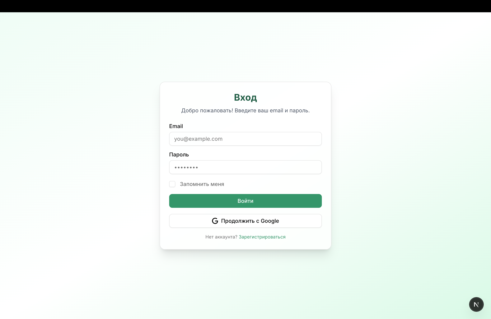
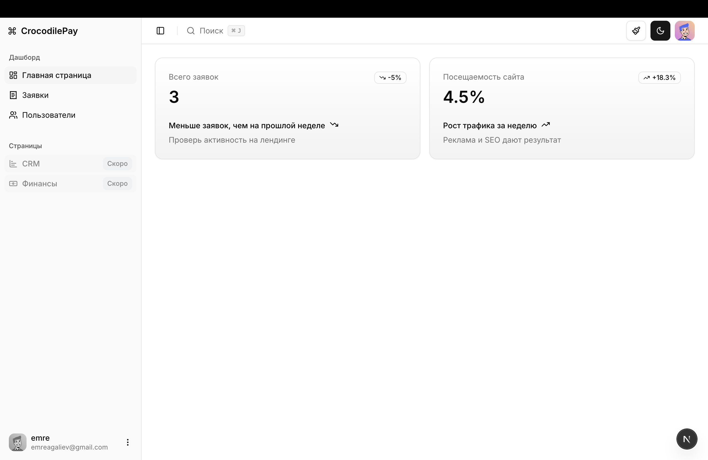
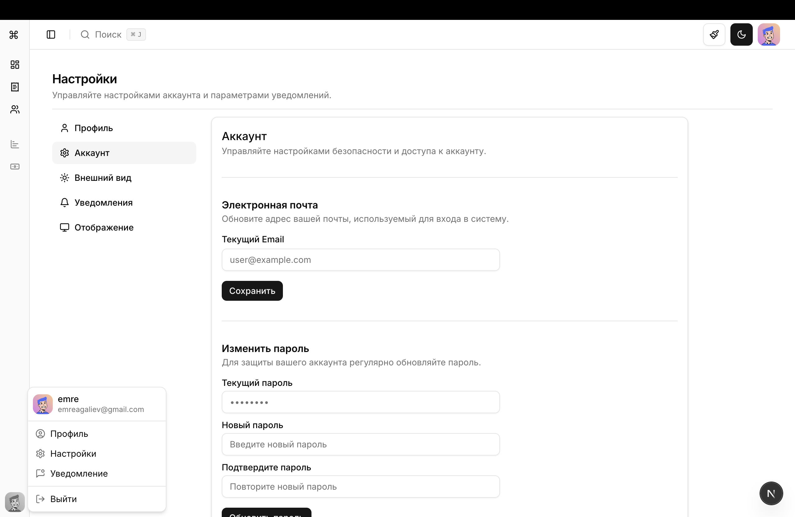

# 🐊 CrocodilePay — Admin Dashboard

> Internal admin panel for managing users, roles, and system settings.

---

## 🧩 Overview

CrocodilePay Admin is a secure web application that provides administrative tools for internal operations.  
It includes authentication, role-based access control (RBAC), and API integration with the CrocodilePay backend.

### 🖼 Preview

| Login Page | Dashboard | User Management |
|-------------|------------|-----------------|
|  |  |  |

> *(All screenshots are from the development build — light theme by default.)*


---

## ⚙️ Tech Stack

### Backend
- **Node.js + Express.js**
- **PostgreSQL** (via **Drizzle ORM**)
- **JWT Auth** with HTTP-only cookies
- **Zod** for validation
- **Helmet**, **Rate Limit**, **Compression**

### Frontend
- **Next.js (App Router)**
- **TailwindCSS** + **shadcn/ui**
- **Axios** for API requests
- **Sonner** for notifications

---

## 🚀 Setup

```bash
# Clone repository
git clone https://github.com/emreaaga/croco-fullstack.git
cd croco-fullstack

Backend
npm install
npm run dev

Frontend
cd frontend
npm install
npm run dev

🧱 Features

- **🔐 User authentication (login, register, logout)
- **🧾 Role-based access control (admin / user)
- **⚙️ Secure API endpoints
- **🧠 Clean MVC structure
- **🌐 REST communication between backend and frontend
